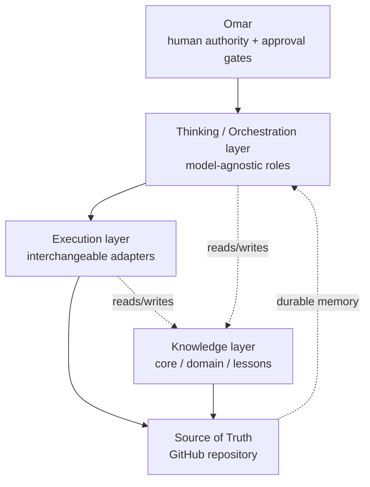
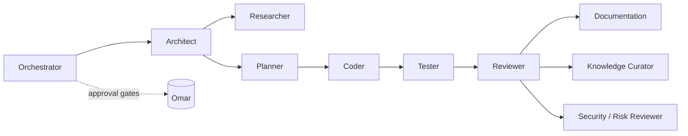
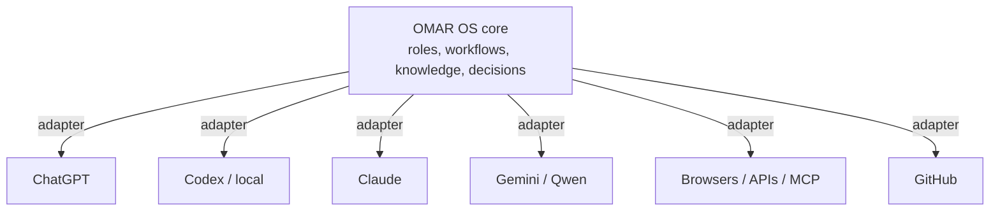

# Architecture — OMAR OS

> The **structure** of the system. The binding rules are in
> [`../PROJECT_CONSTITUTION.md`](../PROJECT_CONSTITUTION.md); the *process* is in
> [`WORKFLOW.md`](WORKFLOW.md); *how* thinking and execution are separated is in
> [`OPERATING_MODEL.md`](OPERATING_MODEL.md). This document is the authoritative home for
> the architecture. Other docs link here rather than re-describing it.

## Design goals

1. **Model-agnostic** — no workflow depends on one AI provider (constitution principle G).
2. **Layered** — separate *thinking/orchestration* from *execution*.
3. **Knowledge-tiered** — keep long-lived core knowledge free of short-lived project detail.
4. **Durable** — GitHub is the versioned source of truth (see
   [`SOURCE_OF_TRUTH.md`](SOURCE_OF_TRUTH.md)).
5. **Replaceable adapters** — integrations plug in without rewriting the core.
6. **Simple** — the least complex design that meets the requirement (principle L).

## Conceptual layers

- **Thinking / Orchestration** — analysis, decomposition, planning, review. Performed by
  reasoning models (e.g. ChatGPT, Claude, Gemini, Qwen) *or* any future model.
- **Execution** — repository inspection, file manipulation, coding, testing, git,
  local runs. Performed by local agents (e.g. Codex) or tools.
- **Knowledge** — the three tiers (below), version-controlled.
- **Source of Truth** — this GitHub repository.

## Role architecture (logical roles, not model names)

OMAR OS is built around **roles**. One model may perform several roles in v0.1; the roles
are stable even as models change. The full role specifications are in
[`../agents/`](../agents/). Each is a *specification*, not running code.

| # | Role | Responsibility |
|---|------|----------------|
| 1 | **Orchestrator** | Understands the objective and manages the workflow. |
| 2 | **Architect** | Decomposes problems, designs architecture, creates flows, identifies dependencies/alternatives. |
| 3 | **Researcher** | Finds and evaluates evidence and source material. |
| 4 | **Planner** | Converts approved architecture into executable work packages. |
| 5 | **Coder** | Implements software. |
| 6 | **Tester / QA** | Tests implementation independently from the coder where practical. |
| 7 | **Reviewer** | Checks whether the implementation solves the original problem. |
| 8 | **Documentation Agent** | Maintains documentation and records important changes. |
| 9 | **Knowledge Curator** | Decides what lessons belong in core / domain / project knowledge. |
| 10 | **Security / Risk Reviewer** | Looks for security, privacy, reliability, or operational risks. |

## Knowledge tiers

Three tiers, kept strictly separate (detail in [`KNOWLEDGE_MODEL.md`](KNOWLEDGE_MODEL.md)):

- **Core knowledge** — long-lived principles about how Omar works (methodology, operating
  principles, stable preferences, quality standards, decision rules). Lives in
  [`../knowledge/core/`](../knowledge/core/).
- **Domain knowledge** — reusable knowledge per area (strategy, software, AI, business
  dev, marketing, research, thesis, real estate). Lives in [`../knowledge/domains/`](../knowledge/domains/).
- **Project knowledge** — temporary, project-specific context (requirements, decisions,
  customer info, data). Lives in [`../projects/`](../projects/).

> **Rule:** Do **not** contaminate core knowledge with short-lived project details.

## Source of truth

GitHub (this repo) is the versioned source of truth. Conversation is an interface; git is
durable memory. Critical knowledge becomes version-controlled files — principles,
architecture, workflows, agent definitions, decision records, templates, project
definitions, lessons learned. See [`SOURCE_OF_TRUTH.md`](SOURCE_OF_TRUTH.md).

## Model-agnostic adapters

Adapters translate between the stable core and specific implementations. Nothing in the
core may hard-code a provider.

The first software core (Phase 1+) must be **small, testable, local-first, and
replaceable**.

## What is intentionally NOT here yet

- No multi-agent runtime (do not over-build in v0.1).
- No cloud infrastructure, no large dependencies.
- No specific provider SDK bundled into the core.

These are phased in via [`../ROADMAP.md`](../ROADMAP.md) (INTEGRATION v0.4 onward).
