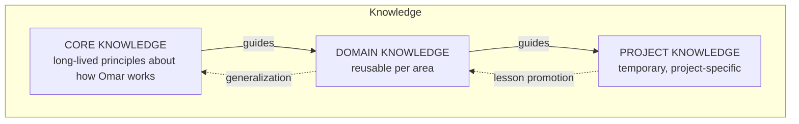
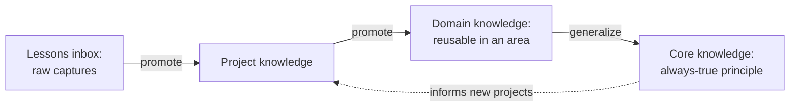

# Knowledge Model — OMAR OS

> How OMAR OS organizes knowledge into **three tiers**, and how lessons move between them.
> The architecture that hosts these tiers is in [`ARCHITECTURE.md`](ARCHITECTURE.md). This
> document is the authoritative home for the knowledge model.

## The three tiers

OMAR OS strictly separates different types of knowledge so that long-lived principles are
not polluted by short-lived project detail.

### Core knowledge

Long-lived principles about how Omar works:

- thinking methodology
- operating principles (constitution A–L)
- stable preferences
- quality standards
- decision rules

**Store in:** [`../knowledge/core/`](../knowledge/core/). Rarely changes; changes should be
deliberate and ADR-backed.

### Domain knowledge

Reusable knowledge associated with an area, such as:

- strategic planning
- software engineering
- AI
- business development
- digital marketing
- academic research
- DBA / MBA thesis work
- real estate

**Store in:** [`../knowledge/domains/`](../knowledge/domains/), one subdirectory per domain.

### Project knowledge

Temporary, project-specific context:

- requirements
- documents
- project decisions
- customer information
- project data

**Store in:** [`../projects/`](../projects/), one subdirectory per project (start from
[`../projects/_template/`](../projects/_template/)).

> **Rule:** Do **not** contaminate core knowledge with short-lived project details.

## Lesson promotion (learn from work)

The **three knowledge tiers are Core / Domain / Project** — *not* a "lessons" tier.
"Lessons" is an **inbox / promotion queue**, not a tier: lessons are captured in
[`../knowledge/lessons/`](../knowledge/lessons/) as raw captures and are then *promoted*
into one of the three tiers by the Knowledge Curator. Nothing should live permanently in
`lessons/`.

Constitution principle K: reusable lessons should move into knowledge/workflow/templates
rather than being rediscovered. The **Knowledge Curator** role
([`../agents/knowledge_curator.md`](../agents/knowledge_curator.md)) decides placement.

Promotion criteria (guidance, not hard rules):

- **Lessons → Project:** the lesson is specific to one project's context.
- **Project → Domain:** the lesson will likely recur in the same domain.
- **Domain → Core:** the lesson is true across domains and reflects how Omar works.

## Storage convention (v0.1)

In v0.1 these tiers are **folders with Markdown**. No database yet. Later phases
([`../ROADMAP.md`](../ROADMAP.md) KNOWLEDGE v0.5) may add structured storage and automated
context assembly. The *model* (tiers + promotion) is stable regardless of the storage
mechanism.
