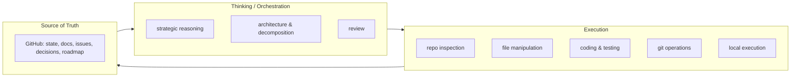
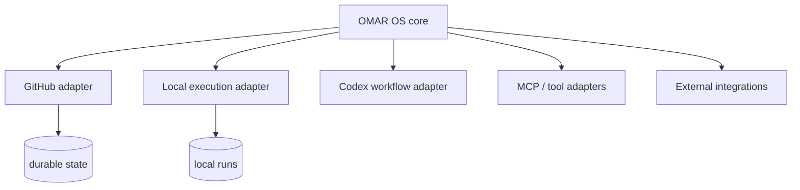

# Operating Model — OMAR OS

> How OMAR OS **separates thinking from execution** and plugs in interchangeable tools.
> The role structure is in [`ARCHITECTURE.md`](ARCHITECTURE.md); the process is in
> [`WORKFLOW.md`](WORKFLOW.md). This document owns the *thinking-vs-execution* concept.

## The core separation

OMAR OS conceptually separates **THINKING / ORCHESTRATION** from **EXECUTION**. This keeps
the durable reasoning independent of whichever tool happens to run the work today.

## Where each kind of work happens

| Layer | Typical actors (examples, not requirements) | Work |
|-------|---------------------------------------------|------|
| **Thinking / Orchestration** | A reasoning model (ChatGPT, Claude, Gemini, Qwen, …) | strategic reasoning, architecture, decomposition, review |
| **Execution** | Local agents (Codex, local models), tools | repository inspection, file manipulation, coding, testing, git, local runs |
| **Durable state** | GitHub | version control, documentation, issues, decisions, roadmap |

> The named models are **examples of replaceable workers**, not requirements. Any can be
> swapped without changing the operating model (constitution principle G).

## Adapters (interchangeable)

Future adapters connect OMAR OS to more capabilities. None is coupled into the foundation.

- Additional LLMs (Claude, Gemini, others)
- Local models
- Browsers (for research and automation)
- Cloud services and APIs
- Desktop automation
- **GitHub** (already the durable store)
- **MCP / tool adapters** (external tools expose capabilities)

## Why this shape

- **Resilience:** if one model or tool is replaced, the orchestration logic and knowledge
  survive (principle G).
- **Clarity:** thinking is auditable; execution is observable and reversible where possible.
- **Simplicity:** the foundation ships with no runtime — just the contract (principle L).

## Status

In v0.1 this is a **specification**. No adapter is implemented. The GitHub adapter and
local execution adapter are planned for INTEGRATION v0.4 (see [`../ROADMAP.md`](../ROADMAP.md)).
