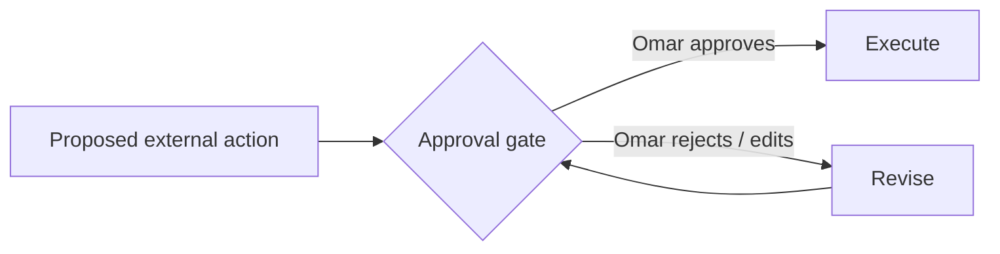

# Security — OMAR OS

> Secrets, human authority, and approval gates. The binding requirements are constitution
> principles H (human authority) and I (human-in-the-loop gates). This document is their
> authoritative home.

## 1. Secrets and credentials

- **Never commit secrets or API keys** to the repository. Use environment variables or a
  secrets manager.
- `.gitignore` already excludes common secret files; do not loosen it for convenience.
- If a secret is accidentally committed, rotate it and remove it from history — do not just
  delete the line.
- The repository contains **no** cloud infrastructure or provider SDKs in v0.1, so there is
  nothing secret to store yet. This policy applies as integrations are added.

## 1b. Data classification & the public/private boundary

The public `omar-os` repository is **not** a safe place for sensitive personal data. Every
artifact must carry a classification (`public | internal | confidential | restricted`; see
[`SOURCE_OF_TRUTH.md`](SOURCE_OF_TRUTH.md)). Rules:

- **confidential** (customer information, contracts, academic/thesis submissions, business
  data, PII) and **restricted** (financial records, personal sensitive data) **must not** be
  committed to the public repo — they live in a **private workspace / secure store**.
- **credentials** (API keys, passwords, tokens) are a *type* of **restricted** data: they go
  to a **secrets manager**, never in git.
- This split is formalized in
  [`../decisions/ADR-0002-public-private-split.md`](../decisions/ADR-0002-public-private-split.md).

## 2. Human authority

Omar is the **final authority** for important or consequential decisions (constitution
principle H). The system may recommend; it does not autonomously bind Omar to
consequential outcomes.

## 3. Human-in-the-loop approval gates

External actions with meaningful consequences must support an **approval gate** before
execution (principle I). Examples:

- applying for a job
- sending external communications
- modifying production infrastructure
- deleting important data
- financial actions

The expected early real-world workflow — the **Career / Opportunity Agent** — must require
human approval before any external submission (see [`VISION.md`](VISION.md) and
[`../ROADMAP.md`](../ROADMAP.md)).

## 4. Security / Risk Reviewer role

The **Security / Risk Reviewer** ([`../agents/security_risk.md`](../agents/security_risk.md))
is one of the ten OMAR OS roles. It looks for security, privacy, reliability, and
operational risks in proposals and implementations. In v0.1 it is a *specification*; the
quality bar is that risk is considered before consequential execution.

## 5. Least privilege & simplicity

Follow the **simplicity** principle (constitution L): do not add authentication, cloud, or
networking infrastructure before it is needed. When added, prefer the smallest scope that
satisfies the requirement.
