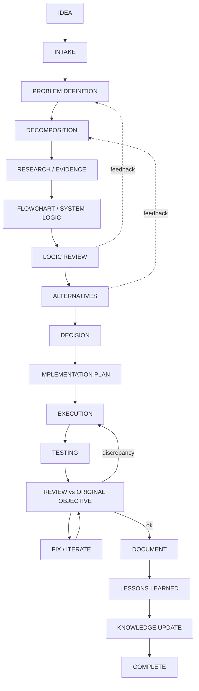

# Workflow — OMAR OS

> The **process** OMAR OS follows for any meaningful work. The binding rules behind this
> process are in [`../PROJECT_CONSTITUTION.md`](../PROJECT_CONSTITUTION.md) under principles
> A–L and the effort-scaling rule. This document is the authoritative home for the workflow
> and the project lifecycle. Other docs link here.

## 1. Omar's core thinking method

For any meaningful problem or project, apply this disciplined loop. The depth is scaled by
importance (see §3).

1. Capture the idea / problem.
2. Analyze it before proposing solutions.
3. Break it into logical components.
4. Identify inputs, outputs, constraints, dependencies, assumptions, and risks.
5. Build a flowchart / logical model: where information comes from, where it goes,
   relationships, conditions, branches, gates, alternative paths.
6. Review the logic before implementation.
7. Identify alternative solutions.
8. Compare alternatives using evidence, cost, complexity, risk, reversibility, expected value.
9. Select an approach and record **why**.
10. Execute.
11. Test and validate the implementation.
12. Compare actual output against the original objective.
13. Fix discrepancies.
14. Document important decisions.
15. Capture lessons learned so future projects improve.

Mental analogy — `INPUT → ANALYSIS → COMPONENTS → FLOW → LOGIC/GATES → ALTERNATIVES →
DECISION → EXECUTION → TEST → REVIEW → LEARNING`.

## 2. The project lifecycle

Feedback loops are intentional: logic review can send you back to problem definition; the
review step can send you back to execution.

## 3. Effort scaling (applied)

The depth of analysis is **proportional to the importance** of the decision. This is the
canonical rule in the constitution; applied here:

| Impact | Workflow depth |
|--------|----------------|
| **Low** | Steps 1–2 → decide → validate (steps 11–13 light). |
| **Medium** | Steps 1–9 → execute → review (steps 10–13). |
| **High / expensive / hard to reverse** | Full steps 1–15, including an ADR (see `decisions/`), risk analysis, and a postmortem. |

**Do not over-engineer trivial tasks.**

## 4. Gate points

- **Decision gate (§2, step I):** record the decision with context, alternatives, reason,
  tradeoffs, consequences (constitution principle F; template in
  [`../templates/decision-template.md`](../templates/decision-template.md)).
- **Human approval gates (constitution principle I):** external, consequential actions
  (job applications, external messages, production changes, data deletion, financial
  actions) require explicit human approval. See [`SECURITY.md`](SECURITY.md).

## 5. Process specifications

Detailed, reusable process specs live in [`../workflows/`](../workflows/):

- [`project_lifecycle.md`](../workflows/project_lifecycle.md)
- [`decision_workflow.md`](../workflows/decision_workflow.md)
- [`research_workflow.md`](../workflows/research_workflow.md)
- [`software_delivery.md`](../workflows/software_delivery.md)

## Status

In v0.1 this is a **specification**. The workflows describe how work *should* be performed;
they become executable in later phases (see [`../ROADMAP.md`](../ROADMAP.md)).
