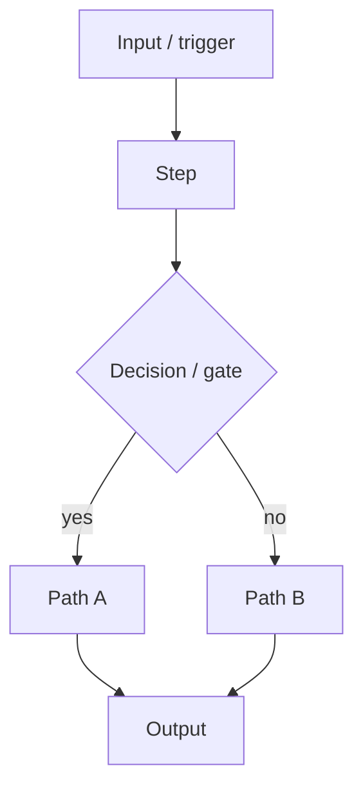

# Flow — <project-name>  (TEMPLATE)

Describe the logical flow / architecture. Use Mermaid where it helps.

## Inputs
-

## Outputs
-

## Dependencies & assumptions
-

## Gates / approval points
- (principle I: external consequential actions need Omar's approval)
